### Data

We have sequenced 75 ATAC-seq libraries from single mouse somites. Samples represent the three most recently segmented somites per embryo, across six different stages; stages are named based on the total number of somites in the embryo. We have 3 to 6 biological replicates per stage.


```r
## metadata
meta <- read.table(paste0(dir, "ATAC-seq/data/metadata_ATACseq.tsv"), stringsAsFactors = FALSE, header = TRUE)
table(stage=meta$stage, somite=meta$somite)
```

```
##      somite
## stage SI SII SIII
##    8   4   4    3
##    18  4   5    4
##    21  4   4    4
##    25  4   4    4
##    27  4   3    3
##    35  6   6    5
```

```r
## BAM files
bam.files <- paste0(meta$sample, ".noDUPs.GQ.bam")
sampleNames <- substr(bam.files, 1, nchar(bam.files)-14)
names(sampleNames) <- bam.files
```

Data were sequenced on an Illumina 4000 to produce paired-end, 150bp long reads, across 10 lanes. Data were mapped to the mouse reference genome (mm10) with `bwa mem`, standard parameters. Around 90% of all fragments were successfully mapped. BAM files for each sample across all lanes were merged.

Sample e33_SII-2 (do26254) was sequenced at a disproportionately high depth so I downsampled to 15% of the total reads, to roughly match the second highest library size in the dataset.

Pre-processing of the BAM files to retain only unique and good-quality alignments involved:

* Removing PCR duplicates with `picard` tools.
* Removing bad quality alignments with `samtools view -bh -q 30 -f 0x02 -F 0x800 -L ATAC-seq/data/mm10_usedChr.bed`. This removes: 
    * alignments with mapping quality lower than 30
    * supplementary alignments
    * improper pairs
* any reads that are not in the `mm10_usedChr.bed` BED file. This file contains only autosomes and the X chromosome, effectively removing alignments in the mitochondrial genome and any contigs and scaffolds.

See `ATAC-seq/scripts/dataProcessing/01.0_producingBAM_goodQualityAlignments.md` for details.

We end up with a BAM file of unique, good quality alignments that we can use for downstream analyses.

### Insert size distribution

The first thing to check to assess data quality is the insert size distribution of the libraries. We expect to see a large number of short fragments plus periodic peaks every 200 base pairs, representing fragments spanning nucleosomes. 

For this we will use `csaw`. We further exclude any alignments that fall within the ENCODE's blacklist. 


```r
blacklist <- readRDS(paste0(dir, "ATAC-seq/data/mm10-blacklist.rds"))
standard.chr <- paste0("chr", c(1:19, "X")) # restrict analysis to autosomes and the X chr.
param <- readParam(minq=30, discard=blacklist, restrict=standard.chr, pe="both", dedup=FALSE)
```

To compute the insert size distribution we use the `getPESizes` function.


```r
## Collect mapping diagnostics as well as the insert size distribution
diagnostics <- list()
stats <- matrix(nrow = length(bam.files), ncol=7) # getPESizes returns 6 metrics: 
                                                 # total.reads,mapped.reads,single,mate.unmapped,unoriented,inter.chr
                                                 # and we will add the fraction of reads with insert sizes smaller than 1kb
i = 1;
for(file in bam.files){
  diagnostics[[file]] <- getPESizes(paste0(dir, "ATAC-seq/data/BWA/", file), param = param)
  valid <- sum(diagnostics[[file]]$sizes<1000)/length(diagnostics[[file]]$sizes)*100
  stats[i,] <- c(diagnostics[[file]]$diagnostics, valid); i <- i+1;
}
colnames(stats) <- c(names(diagnostics[[file]]$diagnostics), "under1kb")
row.names(stats) <- substr(bam.files, 1, nchar(bam.files)-14)
stats <- stats[,c(1:2,4,6,7)] # remove uninteresting columns

saveRDS(diagnostics, paste0(dir, "ATAC-seq/results/01_mappingStats_ATACseq.Rds"))
```

Over 99% of all fragments have insert sizes under 1kb:


```r
summary(stats[,'under1kb'])
```

```
##    Min. 1st Qu.  Median    Mean 3rd Qu.    Max. 
##   99.83  100.00  100.00   99.99  100.00  100.00
```

We filter out anything with an insert size larger than this.

Next we plot the distribution of insert sizes for each sample.


```r
## saples should come in trios but for some embryos some somites failed library prep and are missing.
# Introduce 'blank' plots to keep one embryo per row
samples <- c(bam.files[1:14], "blank", bam.files[15:22], "blank", bam.files[23:24], "blank", bam.files[25:49], "blank", "blank", bam.files[50:63], "blank", bam.files[64:75])
par(mfrow=c(1,3), mar=c(2,2,2,2))
for(file in samples){
  if(file == "blank"){ plot(1,1,col="white", axes=FALSE, xlab="",ylab="") }
  else{
    d <- diagnostics[[file]]$sizes[diagnostics[[file]]$sizes < 1000]
    plot(density(d), xlab="", ylab="", main=sampleNames[file], lwd=2) #, bty="l")
  }
}
```

<!-- -->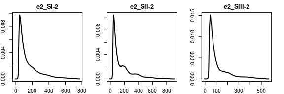<!-- -->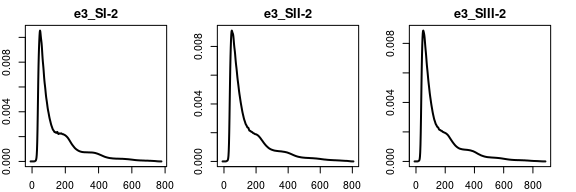<!-- -->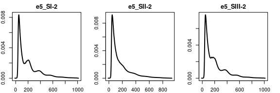<!-- -->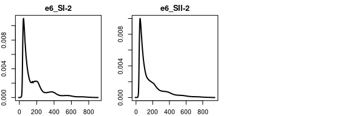<!-- -->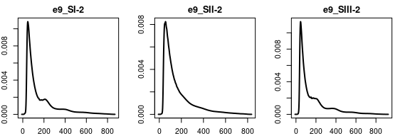<!-- -->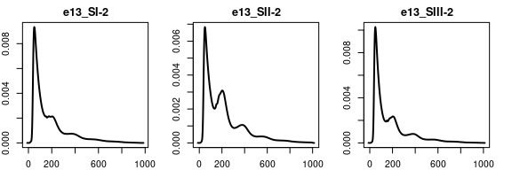<!-- -->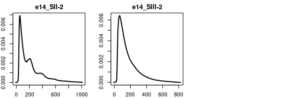<!-- -->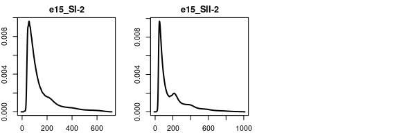<!-- -->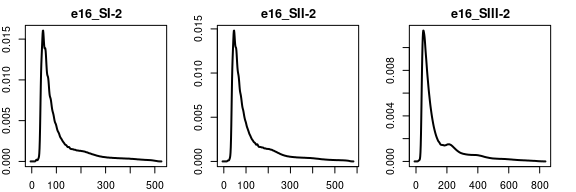<!-- -->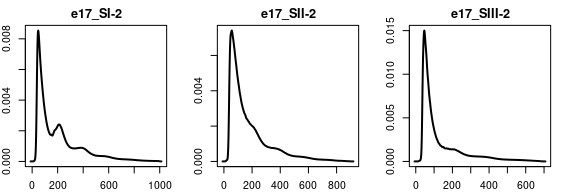<!-- -->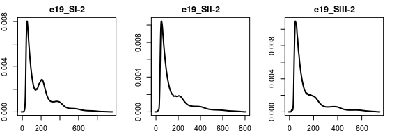<!-- -->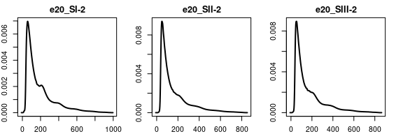<!-- -->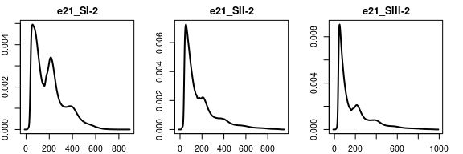<!-- -->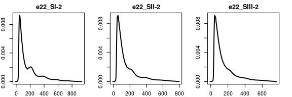<!-- -->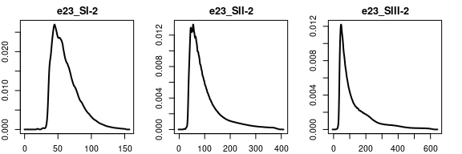<!-- -->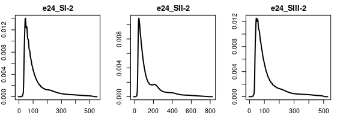<!-- -->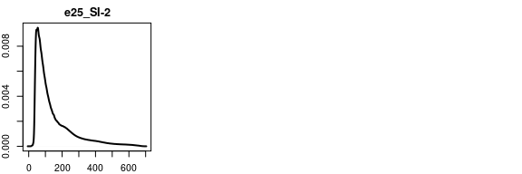<!-- -->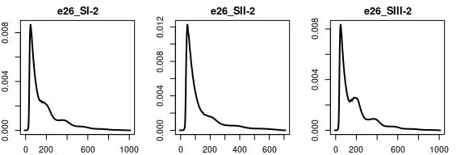<!-- -->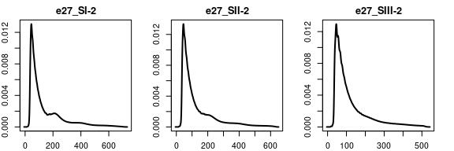<!-- -->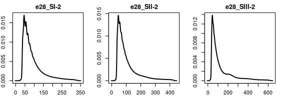<!-- -->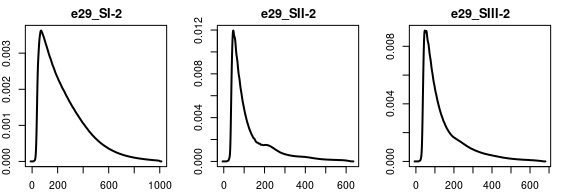<!-- -->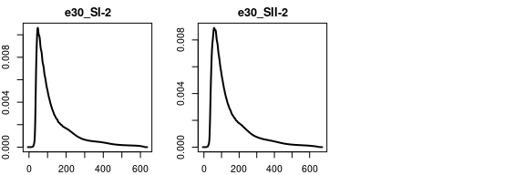<!-- -->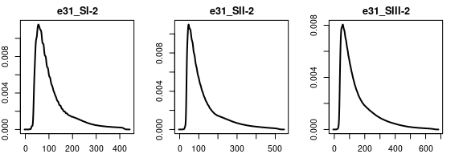<!-- -->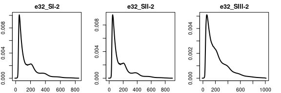<!-- -->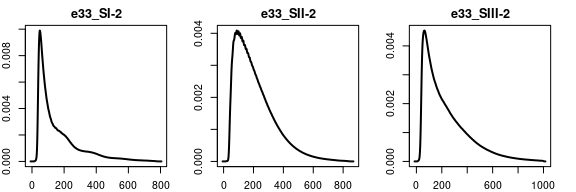<!-- -->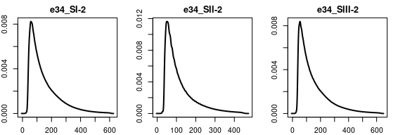<!-- -->

It is evident we have a mix of bad, medium and good quality samples based on the insert size distribution alone.

### Types of insert size distributions

We now cluster the different insert size distributions into general profiles.


```r
## count the number of occurrences for each insert size
insertSizeFreqs <- list()
for(file in bam.files){
  d <- diagnostics[[file]]$sizes[diagnostics[[file]]$sizes < 1000]
  tmp <- table(d)
  insertSizeFreqs[[file]] <- data.frame(sample = sampleNames[file], insertSize = as.numeric(names(tmp)), count = as.numeric(tmp))
}

## uniform all samples to have values for te complete 0:1kb range
for(file in names(insertSizeFreqs)){
  size_range <- 0:1000
	missingBins <- size_range[! size_range %in% insertSizeFreqs[[file]]$insertSize]
  insertSizeFreqs[[file]] <- rbind(insertSizeFreqs[[file]], data.frame(sample = insertSizeFreqs[[file]][1,'sample'],
                                  insertSize = missingBins, count = 0))
  insertSizeFreqs[[file]] <- insertSizeFreqs[[file]][order(insertSizeFreqs[[file]]$insertSize),]
}
saveRDS(insertSizeFreqs, paste0(dir, "ATAC-seq/results/01_insertSizeFrequencies.Rds"))
```

We compute the correlation between all pairs of samples and use hierarchical clustering to group them into the main patterns. Clusters are defined by dynamic tree cut.


```r
curves <- do.call(rbind, lapply(insertSizeFreqs, function(x) x[,3]))
colnames(curves) <- insertSizeFreqs[[1]][,2]

curvesStd <- t(apply(curves, 1, function(x) x/max(x)))  # standarise to [0,1]

# cluster the different profiles
test <- cor(t(curvesStd))
test.dissim <- sqrt(0.5*((1-test)))
test.dist <- as.dist(test.dissim)
test.clust <- hclust(test.dist, method="average")

profiles <- cutreeDynamic(test.clust, distM=as.matrix(test.dist), minClusterSize=5, method="hybrid", deepSplit = 1, verbose = 0)
names(profiles) <- row.names(curvesStd)
table(profiles)
```

```
## profiles
##  1  2  3  4  5 
## 23 23 16  7  6
```

For each pattern we plot the insert size distribution, in regular and log scale.


```r
plots <- list()
for(c in 1:max(profiles)){
  g <- names(profiles[profiles==c])
  test <- curvesStd[g,]
  mean <- colMeans(test)
  std <- apply(test, 2, sd)
  df.sub <- data.frame(x=0:1000, ymin=mean-std, ymax=mean+std)
  df.sub.avg <- data.frame(x=0:1000, y=mean)
  plots[[c]] <- ggplot() + geom_line(data=df.sub.avg, aes(x,y), colour="black" , size=1) +
    geom_ribbon(data=df.sub, aes(x=x,ymin=ymin,ymax=ymax), alpha=0.2, fill="black") +
    xlab(expression("insert size (bp)")) + ylab(expression("")) + ggtitle(paste("Profile", c, "-", nrow(test), "samples")) + 
    theme_bw() + theme(panel.border = element_blank(), panel.grid.major = element_blank(), panel.grid.minor = element_blank(), axis.line = element_line(colour = "black"), plot.title = element_text(size=10, hjust=0.5))
}

for(c in 1:max(profiles)){
  g <- names(profiles[profiles==c])
  test <- log10(curvesStd[g,]+0.01)
  mean <- colMeans(test)
  std <- apply(test, 2, sd)
  df.sub <- data.frame(x=0:1000, ymin=mean-std, ymax=mean+std)
  df.sub.avg <- data.frame(x=0:1000, y=mean)
  plots[[c+5]] <- ggplot() + geom_line(data=df.sub.avg, aes(x,y), colour="black" , size=1) + 
    geom_ribbon(data=df.sub, aes(x=x,ymin=ymin,ymax=ymax), alpha=0.2, fill="black") +
    xlab(expression("insert size (bp)")) + ylab(expression("")) + 
    theme_bw() + theme(panel.border = element_blank(), panel.grid.major = element_blank(), panel.grid.minor = element_blank(), axis.line = element_line(colour = "black"))
}

multiplot(plotlist = plots[c(4,2,3,1,5,9,7,8,6,10)], cols = 5)
```

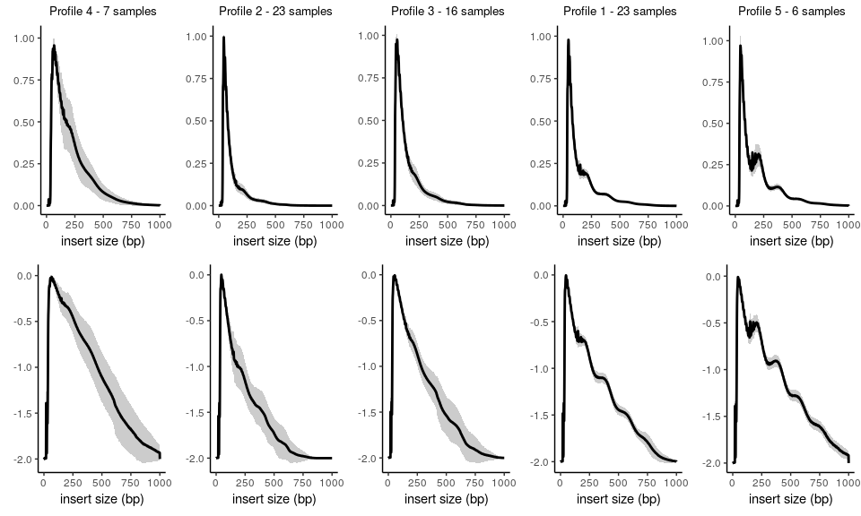<!-- -->

The difference between the profiles is the number of nucleosomal peaks.

### Manual annotation of types of insert size distributions

The most accurate way to assess the quality of the nucleosomal pattern is manual curation. I've gone through all distribution plots and scored them from 0 to 4 depending on the number of bumps. 0 is no nucleosomal pattern; 1 is mononucleosomes only; 2 is mono and di; etc.

Such scores are added to the metadata file.


```r
meta <- read.table(paste0(dir, "ATAC-seq/data/metadata_ATACseq.tsv"), header = TRUE, stringsAsFactors = FALSE)
table(meta$insSizeDist)
```

```
## 
##  0  1  2  3  4 
## 17  8 22 20  8
```

Two thirds of the samples have decent to very good nucleosomal patterns (scores of 2 or higher).

### Correlations to other variables

Finally, we can explore whether the different groups I've annotated correspond to differences in experimental variables of the libraries or depth of sequencing. 

First, we compare to the fragment size determined experimentally for each sample, using the bioanalyzer. Not surprisingly, samples with higher nucleosomal pattern scores have longer fragment sizes.


```r
boxplot(meta$size~meta$insSizeDist, main="DNA fragment size", ylab="bp", xlab="nucleosomal pattern score")
```

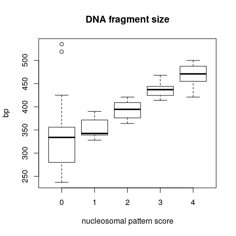<!-- -->

And the opposite pattern is observed in terms of molar DNA concentration.


```r
boxplot(log10(meta$conc)~meta$insSizeDist, main="DNA concentration", ylab=expression('log'[10]*' [nM]'), xlab="nucleosomal pattern score")
```

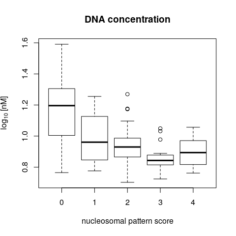<!-- -->

Importantly, there is no correlation with the amount of good quality alignments.


```r
boxplot(meta$goodQuality/1e6~meta$insSizeDist, main="Total unique GQ alignments", ylab="million", xlab="nucleosomal pattern score")
```

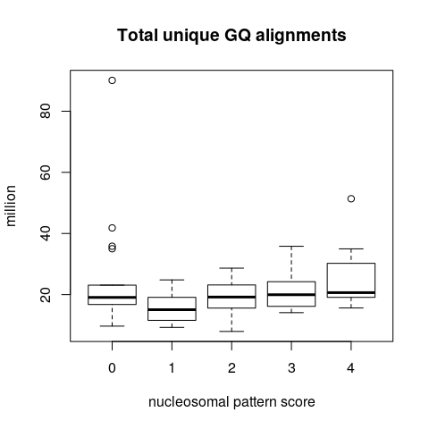<!-- -->

This suggests that the nucleosomal patterns observed do not depend on the sequencing depth but are instead a reflection of the starting material.

## Conclusions

We conclude that the majority of the samples are of good quality, albeit with varying degrees of enrichment for the larger multinucleosomal fragments. Also, that the quality of the data is a reflection of the quality of the starting library; additional sequencing will not improve data quality for those samples with low nucleosomal enrichment.


```r
sessionInfo()
```

```
## R version 3.5.1 (2018-07-02)
## Platform: x86_64-pc-linux-gnu (64-bit)
## Running under: CentOS Linux 7 (Core)
## 
## Matrix products: default
## BLAS: /datastore/sw/gentoo2/usr/lib64/blas/reference/libblas.so.3.7.0
## LAPACK: /datastore/sw/gentoo2/usr/lib64/R/lib/libRlapack.so
## 
## locale:
##  [1] LC_CTYPE=en_GB.UTF-8       LC_NUMERIC=C              
##  [3] LC_TIME=en_GB.UTF-8        LC_COLLATE=en_GB.UTF-8    
##  [5] LC_MONETARY=en_GB.UTF-8    LC_MESSAGES=en_GB.UTF-8   
##  [7] LC_PAPER=en_GB.UTF-8       LC_NAME=C                 
##  [9] LC_ADDRESS=C               LC_TELEPHONE=C            
## [11] LC_MEASUREMENT=en_GB.UTF-8 LC_IDENTIFICATION=C       
## 
## attached base packages:
##  [1] grid      stats4    parallel  stats     graphics  grDevices utils    
##  [8] datasets  methods   base     
## 
## other attached packages:
##  [1] ggplot2_3.0.0               dynamicTreeCut_1.63-1      
##  [3] csaw_1.12.0                 BiocParallel_1.12.0        
##  [5] SummarizedExperiment_1.12.0 DelayedArray_0.4.1         
##  [7] matrixStats_0.54.0          Biobase_2.38.0             
##  [9] Rsamtools_1.34.1            Biostrings_2.50.2          
## [11] XVector_0.22.0              GenomicRanges_1.34.0       
## [13] GenomeInfoDb_1.18.2         IRanges_2.16.0             
## [15] S4Vectors_0.20.1            BiocGenerics_0.28.0        
## 
## loaded via a namespace (and not attached):
##  [1] Rcpp_0.12.18             locfit_1.5-9.1          
##  [3] lattice_0.20-35          prettyunits_1.0.2       
##  [5] assertthat_0.2.0         rprojroot_1.3-2         
##  [7] digest_0.6.15            R6_2.2.2                
##  [9] plyr_1.8.4               backports_1.1.2         
## [11] RSQLite_2.1.0            evaluate_0.11           
## [13] pillar_1.3.0             httr_1.3.1              
## [15] zlibbioc_1.24.0          rlang_0.2.1             
## [17] GenomicFeatures_1.30.3   progress_1.2.0          
## [19] lazyeval_0.2.1           blob_1.1.1              
## [21] Matrix_1.2-14            rmarkdown_1.10          
## [23] labeling_0.3             RMySQL_0.10.15          
## [25] Rhtslib_1.10.0           stringr_1.3.1           
## [27] RCurl_1.95-4.11          bit_1.1-14              
## [29] biomaRt_2.34.2           munsell_0.5.0           
## [31] compiler_3.5.1           rtracklayer_1.42.1      
## [33] pkgconfig_2.0.2          htmltools_0.3.6         
## [35] tidyselect_0.2.4         tibble_1.4.2            
## [37] GenomeInfoDbData_1.0.0   edgeR_3.20.9            
## [39] XML_3.98-1.15            withr_2.1.2             
## [41] dplyr_0.7.6              crayon_1.3.4            
## [43] GenomicAlignments_1.18.1 bitops_1.0-6            
## [45] gtable_0.2.0             DBI_1.0.0               
## [47] magrittr_1.5             scales_1.0.0            
## [49] stringi_1.2.4            bindrcpp_0.2.2          
## [51] limma_3.34.9             tools_3.5.1             
## [53] bit64_0.9-7              glue_1.3.0              
## [55] purrr_0.2.5              hms_0.4.2               
## [57] yaml_2.2.0               AnnotationDbi_1.44.0    
## [59] colorspace_1.3-2         memoise_1.1.0           
## [61] bindr_0.1.1              knitr_1.20
```
